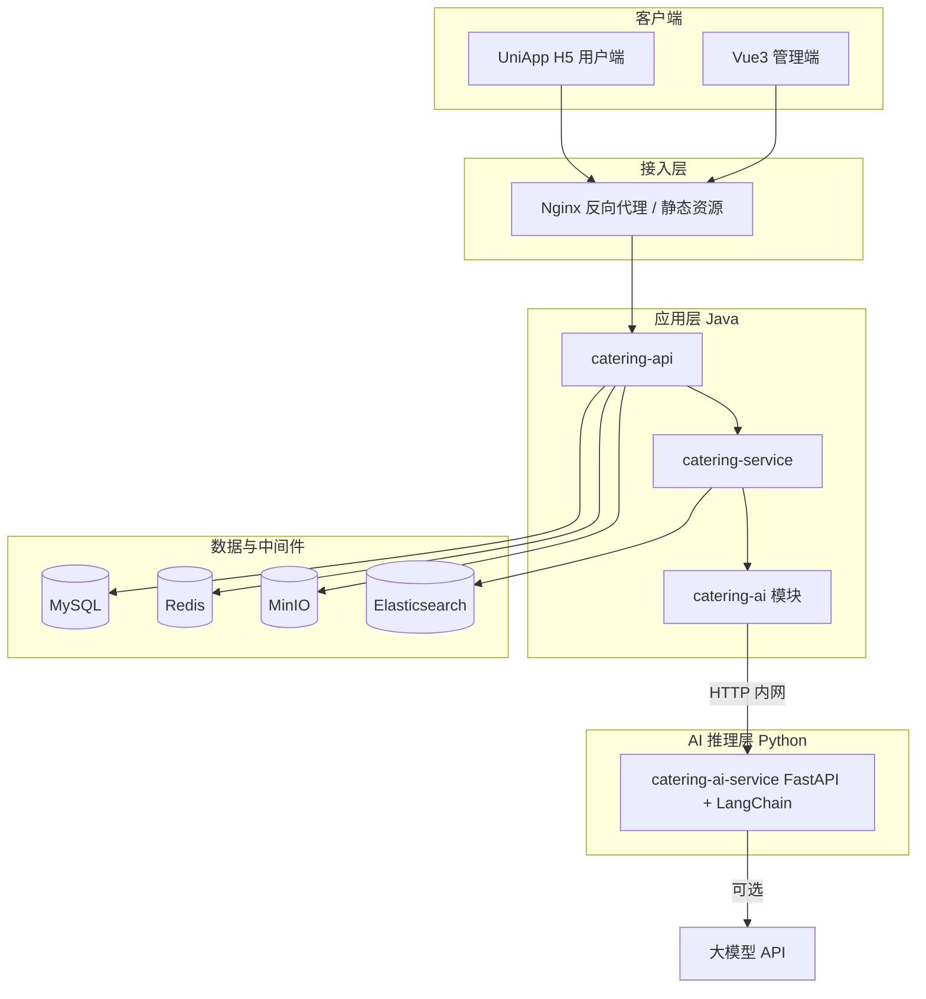

# 餐饮信息采集平台 — 技术设计文档

| 项目 | 内容 |
|------|------|
| 文档版本 | v1.1 |
| 更新日期 | 2026-06-16 |
| 关联文档 | [PRD.md](./PRD.md) v1.2 |

---

## 1. 技术栈确认

### 1.1 总览

| 层级 | 技术选型 | 说明 |
|------|----------|------|
| 后端框架 | **Spring Boot 3.x** | Java 17+，REST API |
| 安全 | **Spring Security** | 认证、鉴权、接口权限 |
| ORM | **MyBatis-Plus** | CRUD、分页、逻辑删除 |
| 主库 | **MySQL 8** | 业务数据持久化 |
| 缓存 | **Redis** | 会话、热点缓存、限流、分布式锁 |
| 对象存储 | **MinIO** | 图片等静态资源 |
| 搜索 | **Elasticsearch 8** | 全文检索、列表筛选 |
| **AI 推理** | **Python + LangChain** | 自然语言解析、审核辅助等 LLM 能力 |
| **AI 接入（Java）** | **catering-ai 模块** | Spring Boot 内独立模块，HTTP 调用 Python 服务 |
| 管理端 | **Vue 3** | 运营后台 Web |
| 用户端 | **UniApp** | 首期编译为 **H5（手机浏览器）** |

### 1.2 后端配套（建议版本）

| 组件 | 选型 |
|------|------|
| 构建 | Maven 多模块 |
| API 文档 | SpringDoc OpenAPI 3（Swagger UI） |
| 校验 | Jakarta Validation |
| 工具 | Lombok、MapStruct（DTO 转换） |
| 连接池 | HikariCP（Spring Boot 默认） |
| ES 客户端 | Spring Data Elasticsearch 或 Elasticsearch Java API Client |
| Redis 客户端 | Spring Data Redis + Lettuce |
| MinIO SDK | `io.minio:minio` |
| 定时任务 | Spring `@Scheduled`（过期下架、续期提醒） |
| AI 调用 | Spring `WebClient` / `RestClient`（`catering-ai` 模块内） |

### 1.3 AI 服务配套（Python）

| 组件 | 选型 |
|------|------|
| 语言 | Python 3.11+ |
| Web 框架 | FastAPI（HTTP API，供 Spring 调用） |
| LLM 编排 | LangChain（Chain、Prompt、结构化输出） |
| 模型接入 | LangChain 统一封装（OpenAI 兼容 API / 通义 / 智谱等，配置切换） |
| 依赖管理 | Poetry 或 uv + pyproject.toml |
| 校验 | Pydantic v2 |
| 运行 | Uvicorn；Docker 独立容器 |

### 1.4 管理端配套

| 组件 | 选型 |
|------|------|
| 构建 | Vite |
| 框架 | Vue 3 + TypeScript |
| UI | Element Plus |
| 路由 | Vue Router |
| 状态 | Pinia |
| HTTP | Axios |
| 权限 | 路由守卫 + 按钮级 `v-permission` |

### 1.5 用户端配套

| 组件 | 选型 |
|------|------|
| 框架 | UniApp（Vue 3 语法） |
| 首期目标 | **H5**，适配手机浏览器 |
| UI | uni-ui 或 uView Plus（择一） |
| 请求 | `uni.request` 封装，统一 Token |
| 登录 | 微信 H5 网页授权（公众号）或手机号+验证码（按实际资质选型） |

> 微信小程序可作为二期，与 H5 共用同一套后端 API；UniApp 条件编译区分端能力。

---

## 2. 系统架构



**调用关系说明：**

- 用户/管理端**只访问 Spring Boot**，不直连 Python 服务。
- **`catering-ai`** 是 Maven 独立模块，封装对 Python 的 HTTP 客户端、DTO、熔断与超时；**不含** LangChain 逻辑。
- **`catering-ai-service`** 是 Python 独立进程，专注 LangChain 编排与 Prompt。
- 智能搜索典型链路：`Controller` → `SearchService` → `AiFacade`（catering-ai）→ Python → 返回结构化筛选条件 → `SearchService` 查 ES → 返回列表。

### 2.1 职责划分

| 存储 | 职责 |
|------|------|
| **MySQL** | 用户、信息帖、审核记录、地区树、举报、收藏、系统配置、操作日志 |
| **Redis** | 登录 Token 黑名单、短信验证码、接口限流、地区树缓存、热搜词（可选） |
| **MinIO** | 信息帖图片、举报截图；对外经 Nginx 或预签名 URL 访问 |
| **Elasticsearch** | 信息帖检索索引；智能搜索的**执行层**（条件由 AI 解析后仍由 Java 查 ES） |
| **Python AI 服务** | 自然语言理解、结构化输出、审核辅助；**不直连 DB/ES** |

### 2.2 读写路径

- **写路径**：用户发布/编辑 → MySQL（待审）→ 审核通过 → 写入/更新 ES 索引。
- **读路径（列表/搜索）**：优先查 ES；详情走 MySQL（保证状态、电话权限准确）。
- **续期**：只更新 MySQL 的 `expire_at`、`renew_count`，**同步更新 ES**，**不创建审核单**。
- **智能搜索**：用户自然语言 → `catering-ai` 调 Python（LangChain）→ 得到 `PostSearchFilter` → Java 构建 ES 查询 → 返回结果。

---

## 3. 工程结构

建议 monorepo 布局：

```
catering-information-collection/
├── docs/
├── catering-server/              # Java 后端父工程
│   ├── catering-common/
│   ├── catering-model/
│   ├── catering-dao/
│   ├── catering-ai/              # ★ AI 接入模块（HTTP 客户端、DTO、Facade）
│   ├── catering-service/         # 业务逻辑（依赖 catering-ai）
│   ├── catering-api/             # Controller、启动类
│   └── catering-job/
├── catering-ai-service/          # ★ Python AI 服务（FastAPI + LangChain）
│   ├── app/
│   │   ├── main.py
│   │   ├── api/                  # 路由
│   │   ├── chains/               # LangChain 链
│   │   ├── prompts/              # Prompt 模板
│   │   ├── schemas/              # Pydantic 模型
│   │   └── core/                 # 配置、LLM 工厂
│   ├── pyproject.toml
│   └── Dockerfile
├── catering-admin/
├── catering-app/
├── deploy/
└── sql/
```

**Maven 模块依赖：**

```
catering-api → catering-service → catering-ai → catering-common
                              ↘ catering-dao → catering-model
```

- `catering-ai` **不依赖** `catering-dao`，避免 AI 层与持久层耦合。
- `catering-service` 中的 `SearchService`、`AuditAssistService` 注入 `AiFacade` 调用 AI 能力。

---

## 4. 后端设计

### 4.1 模块与包结构（catering-api 示例）

```
com.catering.api
├── config/          # Security、Redis、MinIO、ES、CORS
├── security/        # JwtFilter、UserDetails、权限注解
├── controller/
│   ├── app/         # 用户端 API  /api/app/**
│   └── admin/       # 管理端 API  /api/admin/**
├── handler/         # 全局异常、统一返回
└── CateringApplication.java
```

### 4.2 API 划分

| 前缀 | 调用方 | 认证 |
|------|--------|------|
| `/api/app/**` | UniApp H5 | 用户 JWT；部分接口可匿名（列表、详情不含电话） |
| `/api/admin/**` | Vue3 管理端 | 管理员 JWT + RBAC |
| `/api/common/**` | 两端共用 | 如：地区树（只读）、文件上传凭证 |

### 4.3 统一响应格式

```json
{
  "code": 0,
  "message": "ok",
  "data": {},
  "timestamp": 1718534400000
}
```

| code | 含义 |
|------|------|
| 0 | 成功 |
| 400 | 参数错误 |
| 401 | 未登录 |
| 403 | 无权限 |
| 404 | 资源不存在 |
| 429 | 请求过于频繁 |
| 500 | 服务器错误 |

### 4.4 Spring Security 方案

#### 4.4.1 双端认证隔离

| 端 | 方式 | Token |
|----|------|-------|
| 用户端 | 微信 OAuth / 手机号登录（首期可二选一） | JWT，`sub=userId`，Header：`Authorization: Bearer <token>` |
| 管理端 | 账号密码 + 可选图形验证码 | JWT，`sub=adminId`，独立签名密钥或 `aud=admin` |

- Token 有效期：用户端 7 天（可刷新）；管理端 8 小时。
- Redis 存储 `logout` 黑名单或 `tokenVersion`，支持踢下线。
- 密码：BCrypt 存储（仅管理员）。

#### 4.4.2 权限模型（管理端）

| 角色 | 权限 |
|------|------|
| `ROLE_ADMIN` | 全部 |
| `ROLE_AUDITOR` | 审核、信息查看/下架、举报处理 |
| `ROLE_OPERATOR` | 信息治理、置顶、地区维护、看板只读 |

使用 `@PreAuthorize("hasAuthority('post:audit')")` 或自定义权限表 `sys_role` / `sys_permission`。

#### 4.4.3 用户端接口权限要点

| 规则 | 实现 |
|------|------|
| 未登录可看列表/详情 | `/api/app/posts/**` GET 放行 |
| 电话仅登录可见 | 详情接口根据 `Authentication` 决定 `contactPhone` 是否返回 |
| 发布需登录+绑手机 | `@PreAuthorize` + 业务校验 `user.phone_bound` |

### 4.5 核心业务：信息帖状态机（与 PRD 一致）

```
DRAFT → PENDING → APPROVED → EXPIRED
              ↓         ↓
          REJECTED   OFFLINE
```

**续期接口 `POST /api/app/posts/{id}/renew`：**

- 前置：`status=APPROVED` 且 `renew_count < 1` 且未过期。
- 动作：`expire_at += 15天`，`renew_count++`，`status` 保持 `APPROVED`。
- **不写入** `audit_log` 待审队列。
- 异步或同步更新 ES 文档的 `expire_at`。

### 4.6 地区管理（动态，不定死）

#### 表设计：`region`

| 字段 | 类型 | 说明 |
|------|------|------|
| id | bigint PK | |
| parent_id | bigint | 0 为顶级（省） |
| name | varchar | 地区名称 |
| level | tinyint | 1省 2市 3区县 |
| sort | int | 排序 |
| status | tinyint | 1启用 0停用 |
| created_at / updated_at | datetime | |

- 管理端 CRUD：`/api/admin/regions`。
- 用户端只读：`GET /api/common/regions/tree?status=1`。
- Redis 缓存整棵树，key：`region:tree:enabled`，管理端变更时删除缓存。
- 信息帖存 `region_id`（区县）冗余 `province_name/city_name/district_name` 便于展示与 ES。

### 4.7 MyBatis-Plus 约定

- 全局逻辑删除字段：`deleted`（0/1）。
- 审计字段：`created_at`、`updated_at`、`created_by`（管理端操作）。
- 分页：`Page<T>` + 统一分页参数 `page`、`pageSize`（最大 50）。
- 枚举与数据库：tinyint 存状态码，Java 用 enum。

### 4.8 Elasticsearch 索引

**索引名：** `post_index`（可按环境加前缀 `dev_post_index`）

| 字段 | 类型 | 说明 |
|------|------|------|
| id | long | 与 MySQL 一致 |
| type | keyword | RECRUIT / TRANSFER / RENT / JOB_SEEK / FRANCHISE |
| title | text + keyword | ik_max_word 分词 |
| content | text | 补充说明 |
| province_name, city_name, district_name | keyword | |
| city_id, district_id | long | 筛选 |
| job_type, store_type | keyword | 类型相关 |
| salary_min, salary_max | integer | 招聘/求职 |
| tags | keyword | 包吃住、明火等 |
| status | keyword | 仅索引 APPROVED |
| expire_at | date | 过滤过期 |
| pinned | boolean | 置顶 |
| published_at | date | 排序 |

**同步策略：**

- 审核通过、下架、过期、续期、置顶变更时，发事件更新 ES。
- MVP 可用同步写入；量大后改 MQ（可选，首期不引入）。

**搜索：**

- 关键词 + 筛选条件 → ES `bool` 查询（Java 直接构建）。
- 智能搜索（P1）→ `catering-ai` 调用 Python LangChain 解析自然语言为 `PostSearchFilter`，再由 Java 查 ES（见第 5 章）。

### 4.9 Redis 使用

| Key 模式 | 用途 | TTL |
|----------|------|-----|
| `user:token:{userId}` | 登录态版本 | 7d |
| `admin:token:{adminId}` | 管理端会话 | 8h |
| `sms:code:{phone}` | 短信验证码 | 5min |
| `rate:post:{userId}` | 日发布次数 | 24h |
| `region:tree:enabled` | 地区树缓存 | 1h |
| `lock:post:renew:{id}` | 续期防重复点击 | 10s |
| `rate:ai:search:{userId}` | 智能搜索限流 | 1min |

### 4.10 MinIO

| Bucket | 说明 |
|--------|------|
| `catering-public` | 审核通过后的展示图（可公开读） |
| `catering-private` | 待审/举报材料（预签名访问） |

- 上传流程：客户端请求 `POST /api/common/upload/policy` → 返回预签名 PUT URL 或后端直传。
- 数据库存 `object_key`，访问时拼 CDN/Nginx 地址。

### 4.11 定时任务

| 任务 | 频率 | 说明 |
|------|------|------|
| 过期下架 | 每小时 | `expire_at < now()` → status=EXPIRED，删 ES |
| 到期提醒 | 每天 9:00 | 剩余 2 天 → 写入用户消息表 |
| ES 补偿同步 | 每天凌晨 | 校验 MySQL 与 ES 差异（可选） |

| ES 补偿同步 | 每天凌晨 | 校验 MySQL 与 ES 差异（可选） |

---

## 5. AI 模块设计

AI 能力拆为两层：**Python 负责推理编排（LangChain）**，**Java `catering-ai` 模块负责调用与业务衔接**。用户与运营接口仍由 `catering-api` 统一暴露。

### 5.1 职责边界

| 层级 | 职责 | 不负责 |
|------|------|--------|
| **catering-ai-service（Python）** | NLU、Prompt、结构化 JSON 输出、审核文案建议 | 鉴权、查库、查 ES、写业务数据 |
| **catering-ai（Java 模块）** | HTTP 调用、超时熔断、DTO 转换、`AiFacade` 门面 | LangChain、Prompt 维护 |
| **catering-service** | 组装上下文（地区树摘要等）、执行 ES 查询、记录 AI 调用日志 | 直接调 LLM |
| **catering-api** | `/api/app/search/ai` 等 REST 入口 | AI 细节 |

### 5.2 Python 服务：`catering-ai-service`

#### 5.2.1 技术结构

```
catering-ai-service/
├── app/
│   ├── main.py                 # FastAPI 入口
│   ├── core/
│   │   ├── config.py           # 环境变量、模型配置
│   │   └── llm_factory.py      # LangChain ChatModel 工厂
│   ├── chains/
│   │   ├── search_parse.py     # 智能搜索解析链
│   │   └── audit_hint.py       # 审核辅助链（P2）
│   ├── prompts/
│   │   ├── search_parse.txt
│   │   └── audit_hint.txt
│   ├── schemas/
│   │   ├── search.py           # PostSearchFilter
│   │   └── audit.py
│   └── api/
│       └── v1/
│           ├── search.py
│           └── health.py
├── pyproject.toml
└── Dockerfile
```

#### 5.2.2 LangChain 智能搜索链（核心）

**输入：**

```json
{
  "query": "杭州余杭区大厨 8000 以上 包吃住",
  "context": {
    "province": "浙江省",
    "post_types": ["RECRUIT", "TRANSFER", "RENT", "JOB_SEEK", "FRANCHISE"],
    "cities": ["杭州市", "宁波市"],
    "job_types": ["大厨", "厨师", "传菜员", "服务员"]
  }
}
```

`context` 由 Java 传入当前启用地区与枚举，**缩小模型幻觉空间**。

**输出（Pydantic 结构化）：**

```json
{
  "intent": "search",
  "filters": {
    "type": "RECRUIT",
    "city_name": "杭州市",
    "district_name": "余杭区",
    "job_type": "大厨",
    "salary_min": 8000,
    "tags": ["包吃住"]
  },
  "confidence": 0.92,
  "reply": "正在为您查找杭州余杭区月薪 8000 以上的大厨岗位（包吃住）"
}
```

**LangChain 实现要点：**

- 使用 `ChatPromptTemplate` + `PydanticOutputParser` 或 `with_structured_output()` 约束 JSON Schema。
- 非搜索意图（闲聊）→ `intent: "chitchat"`，Java 返回友好提示并引导筛选。
- 解析失败 → `intent: "fallback"`，Java 降级为关键词搜索。

#### 5.2.3 HTTP API（Python 对内）

| 方法 | 路径 | 说明 |
|------|------|------|
| GET | `/health` | 健康检查 |
| POST | `/v1/search/parse` | 自然语言 → 搜索条件 |
| POST | `/v1/audit/hint` | 审核辅助建议（P2） |

**请求头：**

```
X-Internal-Api-Key: <共享密钥>
Content-Type: application/json
```

Python 服务**不对公网开放**；仅 Docker 内网或 K8s 集群内可访问。

#### 5.2.4 配置项（环境变量）

| 变量 | 说明 |
|------|------|
| `LLM_PROVIDER` | openai / dashscope / zhipu 等 |
| `LLM_API_KEY` | 模型密钥 |
| `LLM_MODEL` | 如 gpt-4o-mini、qwen-turbo |
| `LLM_BASE_URL` | OpenAI 兼容端点（可选） |
| `INTERNAL_API_KEY` | 与 Java 一致的内部密钥 |
| `LOG_LEVEL` | info |

### 5.3 Java 模块：`catering-ai`

#### 5.3.1 包结构

```
com.catering.ai
├── config/
│   └── AiProperties.java          # baseUrl、apiKey、timeout、enabled
├── client/
│   └── AiServiceClient.java         # WebClient 调用 Python
├── dto/
│   ├── SearchParseRequest.java
│   ├── SearchParseResponse.java
│   └── PostSearchFilter.java        # 与 Python filters 对齐
├── facade/
│   └── AiFacade.java                # 对外门面，供 service 注入
├── exception/
│   ├── AiServiceException.java
│   └── AiDegradedException.java     # 触发降级
└── support/
    └── AiCallLogger.java            # 可选：写 ai_call_log
```

#### 5.3.2 AiFacade 接口（示例）

```java
public interface AiFacade {
    /** 自然语言解析为搜索条件；失败时抛出 AiDegradedException */
    SearchParseResponse parseSearchQuery(SearchParseRequest request);

    /** P2：审核辅助 */
    AuditHintResponse auditHint(AuditHintRequest request);

    boolean isAvailable();
}
```

#### 5.3.3 配置（application.yml）

```yaml
catering:
  ai:
    enabled: true
    base-url: http://catering-ai-service:8000
    api-key: ${AI_INTERNAL_API_KEY}
    connect-timeout: 3s
    read-timeout: 15s
    degrade-on-failure: true   # 失败时降级为普通关键词搜索
```

#### 5.3.4 降级策略

| 场景 | 行为 |
|------|------|
| Python 超时/5xx | 记录日志，`degrade-on-failure=true` 时用用户原话做 ES 关键词搜索 |
| `intent=chitchat` | 返回 `reply` 文案，空列表 + 筛选入口 |
| `enabled=false` | 不走 AI，等同普通搜索 |

#### 5.3.5 SearchService 编排（catering-service）

```
1. 接收用户 query + 当前 cityId
2. 从 Redis 取 region 树、枚举字典，组装 SearchParseRequest.context
3. aiFacade.parseSearchQuery(request)
4. 将 filters 转为 EsQueryBuilder
5. 执行 ES 分页查询，附带 parsedFilters 与 reply 返回前端
6. 异步写入 ai_call_log（可选）
```

### 5.4 对外 API（仍由 catering-api 暴露）

**`POST /api/app/search/ai`**

请求：

```json
{
  "query": "宁波火锅店传菜员",
  "cityId": 330200,
  "page": 1,
  "pageSize": 20
}
```

响应：

```json
{
  "code": 0,
  "data": {
    "reply": "为您找到宁波火锅店的传菜员招聘",
    "parsedFilters": {
      "type": "RECRUIT",
      "city_name": "宁波市",
      "job_type": "传菜员",
      "store_type": "火锅"
    },
    "degraded": false,
    "list": { "total": 12, "records": [] }
  }
}
```

### 5.5 审核辅助（P2，可选）

Python `audit_hint` 链输入：帖子类型 + 标题 + 正文摘要 + 是否含图。  
输出：`risk_level`（low/medium/high）、`suggestions[]`（如「转让费为 0，建议核实」）。  
**仅辅助运营**，最终通过/驳回仍由人工在管理端操作。

### 5.6 安全

| 项 | 措施 |
|----|------|
| 网络 | Python 仅内网；不经过 Nginx 暴露 |
| 认证 | `X-Internal-Api-Key` 双向配置 |
| 数据 | 传给 LLM 的文本脱敏手机号；日志不落完整 Prompt 中的隐私 |
| 限流 | Java 侧按 userId 限制 `/search/ai` 如 20 次/分钟 |
| 密钥 | LLM API Key 只在 Python 容器环境变量中 |

### 5.7 部署

Docker Compose 增加服务：

| 服务 | 端口 | 说明 |
|------|------|------|
| catering-ai-service | 8000（仅内网） | Python FastAPI |

```yaml
# deploy/docker-compose.yml 片段
catering-ai-service:
  build: ../catering-ai-service
  environment:
    - LLM_PROVIDER=${LLM_PROVIDER}
    - LLM_API_KEY=${LLM_API_KEY}
    - INTERNAL_API_KEY=${AI_INTERNAL_API_KEY}
  networks:
    - internal
  # 不映射到宿主机公网端口
```

`catering-api` 通过服务名 `http://catering-ai-service:8000` 访问。

### 5.8 可选表：`ai_call_log`

| 字段 | 说明 |
|------|------|
| id, user_id | |
| scene | search_parse / audit_hint |
| request_text | 用户 query（脱敏） |
| response_json | 解析结果 |
| latency_ms | |
| success, degraded | |
| created_at | |

用于统计 AI 使用率与优化 Prompt。

---

## 6. 数据库设计（核心表）

### 6.1 用户与管理员

**`user`（C 端用户）**

| 字段 | 说明 |
|------|------|
| id, open_id, union_id | 微信标识（若用微信登录） |
| phone, phone_bound | 手机号 |
| nickname, avatar | 资料 |
| status | 正常 / 封禁 |
| ban_until | 封禁截止时间 |

**`admin_user` / `sys_role` / `sys_permission`**

标准 RBAC，略。

### 6.2 信息帖 `post`

| 字段 | 说明 |
|------|------|
| id, user_id | |
| type | 五类枚举 |
| status | 状态机 |
| title | |
| region_id | 区县 ID |
| province_name, city_name, district_name | 冗余 |
| contact_name, contact_phone, contact_wechat | |
| extra_json | JSON，存各类型差异字段（薪资、面积、加盟品牌等） |
| cover_image | 首图 object_key |
| images_json | 多图列表 |
| expire_at, renew_count | 续期次数，最大 1 |
| pinned, pin_until | 免费置顶 |
| published_at, approved_at | |
| reject_reason | 最近一次驳回原因 |

**`post_audit_log`**

审核历史：post_id、operator_id、action、reason、created_at。

### 6.3 其他

| 表 | 说明 |
|----|------|
| `post_favorite` | 用户收藏 |
| `post_report` | 举报 |
| `user_message` | 站内消息 |
| `sys_config` | 默认有效期、日发布上限等 KV |
| `sensitive_word` | 敏感词 |
| `region` | 地区树 |
| `ai_call_log` | AI 调用日志（可选，见 TECH 5.8） |

---

## 7. 接口清单（概要）

### 7.1 用户端 `/api/app`

| 方法 | 路径 | 说明 |
|------|------|------|
| POST | `/auth/login/wechat` | 微信登录 |
| POST | `/auth/login/phone` | 手机号+验证码 |
| POST | `/auth/bind-phone` | 绑定手机 |
| GET | `/posts` | 列表（走 ES） |
| GET | `/posts/{id}` | 详情（电话按登录态） |
| POST | `/posts` | 发布 |
| PUT | `/posts/{id}` | 编辑重提 |
| POST | `/posts/{id}/renew` | **续期，免审** |
| POST | `/posts/{id}/offline` | 下架 |
| GET | `/posts/mine` | 我的发布 |
| POST | `/posts/{id}/favorite` | 收藏 |
| POST | `/posts/{id}/report` | 举报 |
| GET | `/messages` | 消息列表 |
| GET | `/search` | 关键词搜索 |
| POST | `/search/ai` | 智能搜索 P1 |

### 7.2 管理端 `/api/admin`

| 方法 | 路径 | 说明 |
|------|------|------|
| POST | `/auth/login` | 管理员登录 |
| GET | `/audit/pending` | 待审队列 |
| POST | `/audit/{postId}/approve` | 通过 |
| POST | `/audit/{postId}/reject` | 驳回 |
| GET | `/posts` | 全量检索 |
| POST | `/posts/{id}/offline` | 强制下架 |
| POST | `/posts/{id}/pin` | 置顶 |
| GET | `/reports` | 举报列表 |
| POST | `/reports/{id}/handle` | 处理举报 |
| GET/POST/PUT/DELETE | `/regions` | **地区动态 CRUD** |
| GET | `/dashboard` | 看板 |
| GET/PUT | `/config` | 系统配置 |

### 7.3 公共 `/api/common`

| 方法 | 路径 | 说明 |
|------|------|------|
| GET | `/regions/tree` | 启用中的地区树 |
| POST | `/upload` | 图片上传 |

---

## 8. 管理端（Vue 3）

### 8.1 页面结构

```
登录
工作台（看板）
审核管理
  └── 待审列表 / 审核详情
信息管理
  └── 列表 / 置顶 / 下架
举报管理
用户管理
地区管理          ← 省市区树形维护，动态新增
系统设置
  └── 敏感词 / 参数配置
权限管理（管理员）
```

### 8.2 与后端协作

- 开发环境 Vite 代理 `/api` → `http://localhost:8080`。
- Token 存 `localStorage`，Axios 拦截器附加 `Authorization`。
- 地区管理：树形表格 + 弹窗表单，变更后用户端下次拉取即生效。

---

## 9. 用户端（UniApp H5）

### 9.1 页面结构

```
pages/
  index/           首页（城市、五类入口、列表）
  list/            分类列表 + 筛选
  detail/          详情（登录后显示电话）
  publish/         发布（五步合一表单）
  search/          搜索
  mine/            我的
  mine/posts       我的发布（含一键续期）
  mine/favorites   收藏
  mine/messages    消息
  login/           登录
```

### 9.2 H5 适配

- `viewport` + `rem`/`rpx`，适老化大字号主题变量。
- 拨号：`uni.makePhoneCall`（H5 调 `tel:`）。
- 微信内浏览器：优先 JS-SDK 分享卡片。

### 9.3 状态与请求

- Pinia：`user`、`city`（当前城市 ID）。
- 启动时拉取 `/api/common/regions/tree` 缓存到本地。
- 401 跳转登录，登录后回跳详情。

---

## 10. 部署与环境

### 10.1 环境划分

| 环境 | 用途 |
|------|------|
| dev | 本地开发 |
| test | 联调测试 |
| prod | 生产 |

### 10.2 推荐部署（Docker Compose 开发/小规模生产）

| 服务 | 端口 | 说明 |
|------|------|------|
| catering-api | 8080 | Spring Boot |
| catering-ai-service | 8000（内网） | Python FastAPI + LangChain |
| MySQL | 3306 | |
| Redis | 6379 | |
| MinIO | 9000 / 9001 | |
| Elasticsearch | 9200 | |
| Nginx | 80 / 443 | 仅反代 Java 与静态资源，**不暴露 Python** |

- 管理端静态资源由 Nginx 托管 `catering-admin/dist`。
- 用户端 H5 托管 `catering-app/dist/build/h5`。
- 同一域名下：`/api` 反代后端，`/admin` 管理端，`/` 用户 H5。

### 10.3 配置外置

使用 `application-{profile}.yml` + 环境变量：

- `MYSQL_*`、`REDIS_*`、`MINIO_*`、`ES_*`
- `JWT_SECRET_USER`、`JWT_SECRET_ADMIN`
- `AI_INTERNAL_API_KEY`、`catering.ai.base-url`
- 微信 AppId/Secret（若启用）

Python 服务环境变量见 **5.2.4**；`LLM_API_KEY` 仅配置在 Python 容器。

---

## 11. 安全与合规

| 项 | 措施 |
|----|------|
| 传输 | 全站 HTTPS |
| 接口 | 发布/登录限流（Redis） |
| 敏感数据 | 手机号脱敏日志；列表不返回完整电话 |
| 上传 | 类型白名单 jpg/png，大小 ≤ 5MB |
| SQL | MyBatis 参数化，禁止拼接 |
| XSS | 前端转义 + 后端富文本过滤（若需要） |
| 管理端 | 强密码策略、操作审计日志 |

---

## 12. MVP 技术范围

### 12.1 本期实现

- 后端完整状态机、审核、续期免审、地区动态管理。
- ES 基础搜索 + 筛选。
- **`catering-ai` 模块 + `catering-ai-service`（Python LangChain）**，智能搜索 P1。
- MinIO 图片上传。
- Vue3 管理端：审核、信息、举报、用户、地区、置顶。
- UniApp H5：PRD MVP 全部用户端能力。

### 12.2 本期不实现

- 微信小程序包（代码可预留条件编译）。
- 消息队列、微服务拆分（除 AI Python 独立进程外，Java 仍单体）。
- 付费置顶、中介入驻。
- 对话式 AI 顾问（P3）；审核辅助链（P2）可排期。

---

## 13. 开发顺序建议

1. **基础设施**：MySQL、Redis/MinIO/ES Docker、Spring Boot 多模块骨架。
2. **地区模块**：管理端维护 + 公共树接口。
3. **管理员认证** + Vue3 登录框架。
4. **信息帖 CRUD** + 审核流 + ES 同步。
5. **用户端认证** + UniApp 发布/列表/详情。
6. **续期、过期任务、消息通知**。
7. **收藏、举报、看板、置顶**。
8. **AI 模块**：Python `search/parse` 链 + Java `catering-ai` + `/api/app/search/ai`。
9. 审核辅助 `audit/hint`（P2，可选）。

---

## 14. 修订记录

| 版本 | 日期 | 说明 |
|------|------|------|
| v1.0 | 2026-06-16 | 初版，确认技术栈与架构 |
| v1.1 | 2026-06-16 | 新增 AI 模块：Python LangChain 服务 + Java catering-ai 模块 |
